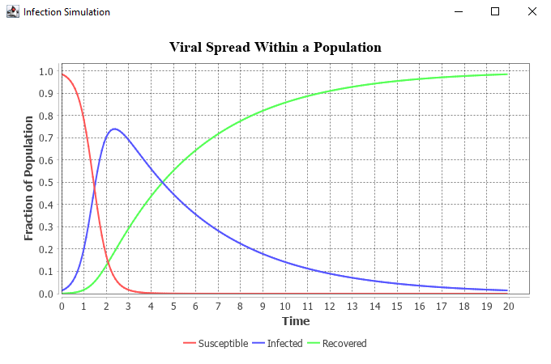

# infection

Drop this Maven project into Eclipse and build 

## Run

java -cp ${CLASSPATH} com.rsmaxwell.infection.app.App -c <CONFIG>

Where <CONFIG> is a directory containing:
  - a file: "config.json"
  - a directory: "groups"
  - a directory: "connectors"
  

## Configuration

### config.1

This directory contains a configuration of a single population. 

The supplied launch configuration "infection-1.launch" will run configuration which defines a single population   

### config.2

The supplied launch configuration "infection-2.launch" will run configuration which defines two populations with 
the same "recovery" parameter and with transmission between them.
 
This is a test configuration to make sure the result is equivalent to a single population    

## Results 

